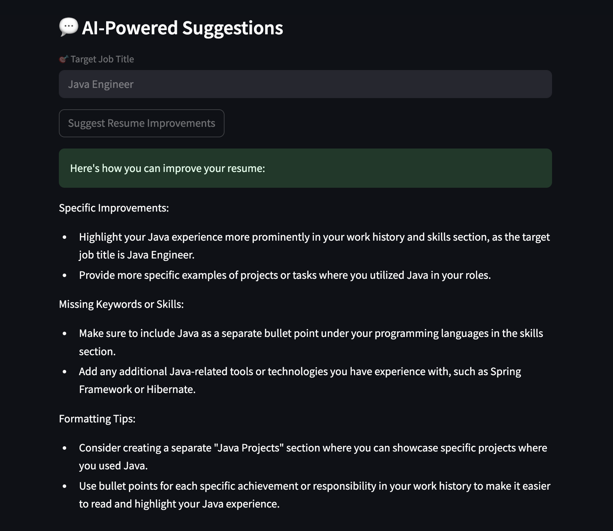
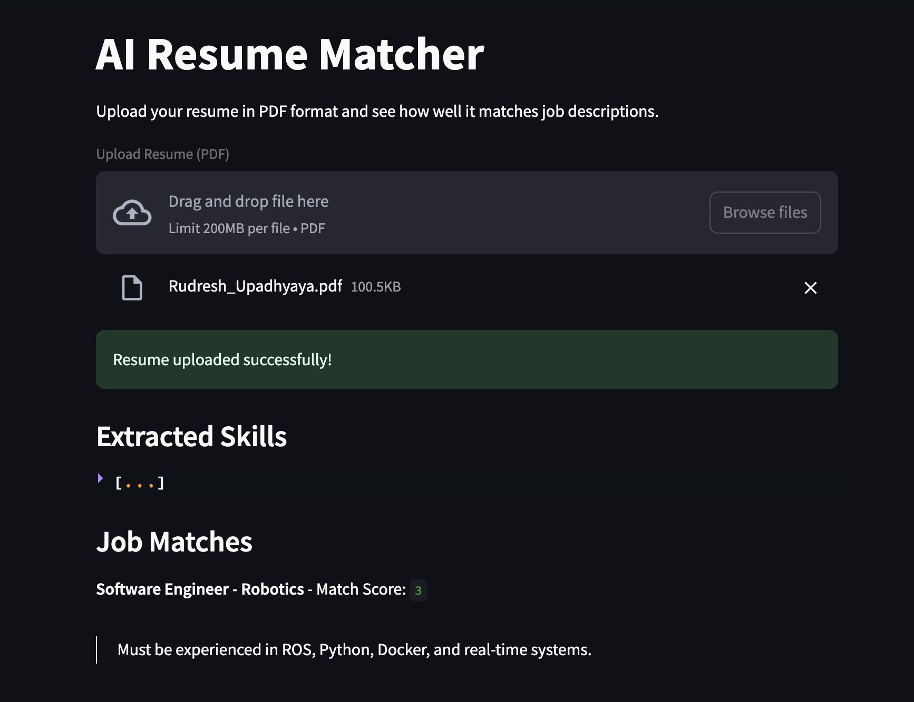

# 🤖 AI Resume Matcher

Upload your resume (PDF), extract skills using NLP, match with job listings, and get GPT-powered suggestions — all in a clean web UI.

### 🚀 Features
- Resume parsing (PDF)
- NLP-powered skill extraction (spaCy)
- GPT-3.5 suggestions for improvements
- Streamlit UI
- Deployable & customizable

### 📸 Demo

### 📦 Tech Stack
- Python, spaCy, Streamlit, OpenAI API
